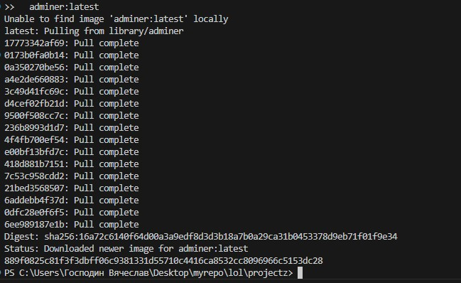
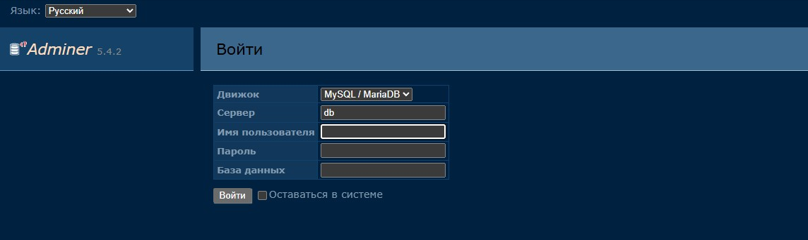

# Adminer (альтернатива phpMyAdmin)

Никогда в разработке не используйте русские имена файлов и каталогов!
Никогда в разработке не используйте пробелы и спец.символы в именах файлов и каталогов!

Выполните все этапы работы с проектом по примеру с Nginx

---

## Запуск Adminer для управления БД

Перед созданием проекта убедитесь, что порт `8084` не занят другим приложением!

В Windows Powershell:

```powershell
docker run -d `
  --name adminer `
  -p 8084:8080 `
  adminer:latest
```

В Git-Bash/Linux/WSL 2.0/Mac:

```bash
docker run -d \
  --name adminer \
  -p 8084:8080 \
  adminer:latest
```



---

## Откройте: http://localhost:8084

> Без отдельно запущенного контейнера с БД PostgreSQL и связи с ним админ-панель работать не будет!



---

