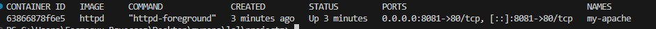
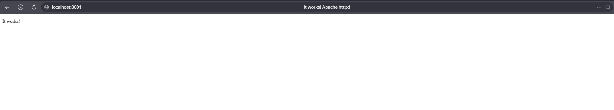
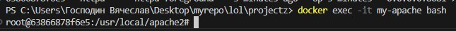
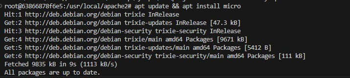
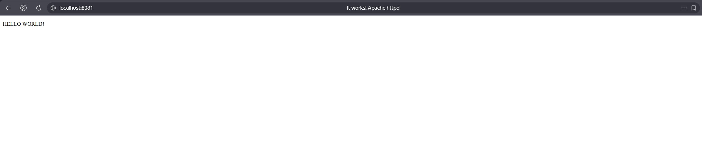

# Apache

Никогда в разработке не используйте русские имена файлов и каталогов! Никогда в разработке не используйте пробелы и спец.символы в именах файлов и каталогов!

Выполните все этапы работы с проектом по примеру с Nginx

---

## Получить образ, создать и запустить контейнер

```bash
docker run -d --name my-apache -p 8081:80 httpd
```



---

## Откройте адрес http://localhost:8081 в браузере



---

## Редактирование веб-страницы

Зайти в контейнер:

```bash
docker exec -it my-apache bash
```



Установить текстовый редактор командной строки Micro:

```bash
apt update && apt install micro
```



Открыть файл `index.html` для редактирования содержимого:

```bash
micro /usr/local/apache2/htdocs/index.html
```

Чтобы в веб-странице поддерживался русский язык, вставьте тэг `<meta charset="UTF-8">`, отредактируйте и сохраните по `Ctrl+S` и выйти из режима редактирования по `Ctrl+Q`


---

## Проверьте результат по адресу http://localhost:8081



---

## Выйти из контейнера

```bash
exit
```

