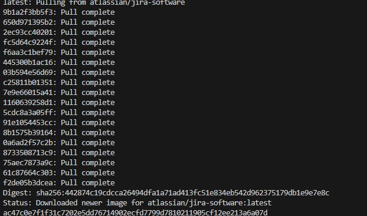
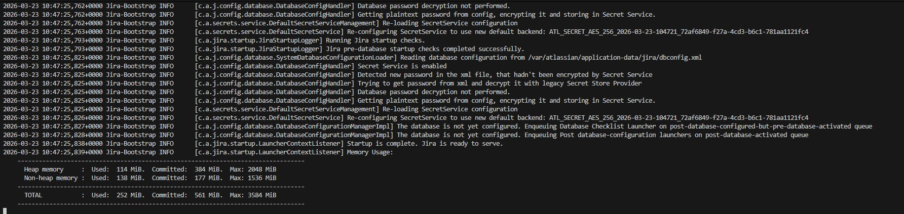
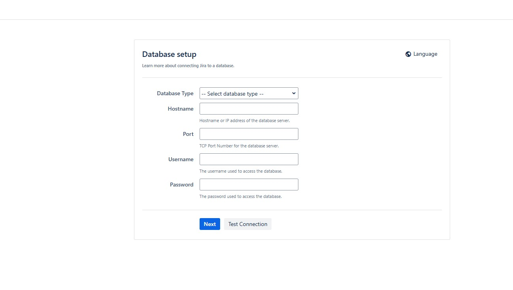

# Jira

Никогда в разработке не используйте русские имена файлов и каталогов!
Никогда в разработке не используйте пробелы и спец.символы в именах файлов и каталогов!

Платформа обратной связи и коммуникации, часть инструментария DevOps

Выполните все этапы работы с проектом по примеру с Nginx

---

## Загрузить образ, создать и запустить контейнер

```bash
docker run -d --name jira -p 2990:8080 atlassian/jira-software:latest
```

или

```bash
docker run -d --name jira -p 2990:8080 addono/jira-software-standalone
```



---

## Запустите лог Jira для наблюдения за процессом подготовки приложения

```bash
docker logs -f jira
```

> Образ при первом запуске долго инициализируется (до 5-10 минут). Приложение, запущенное в контейнере может готовиться долго, поэтому в браузере вы не сразу можете увидеть результат.



---

## Зайти в админ-панель Jira в браузере по адресу http://localhost:2990

> Заполнять данные админ-панели не нужно!


