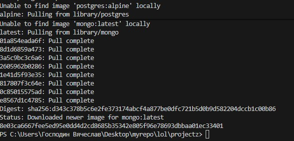
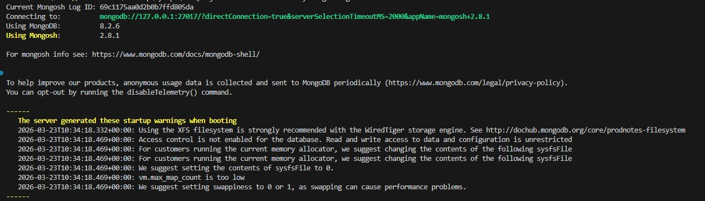
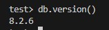

# MongoDB (NoSQL)

Никогда в разработке не используйте русские имена файлов и каталогов!
Никогда в разработке не используйте пробелы и спец.символы в именах файлов и каталогов!

Выполните все этапы работы с проектом по примеру с Nginx

---

## 1. Запуск MongoDB

В Windows Powershell:

```powershell
docker run -d `
  --name my-mongo `
  -p 27017:27017 `
  mongo:latest
```

В Git-Bash/Linux/WSL 2.0/Mac:

```bash
docker run -d \
  --name my-mongo \
  -p 27017:27017 \
  mongo:latest
```



---

## 2. Подключиться через shell

```bash
docker exec -it my-mongo mongosh
```



---

## Повыполняйте какие-нибудь команды в этой БД для проверки


