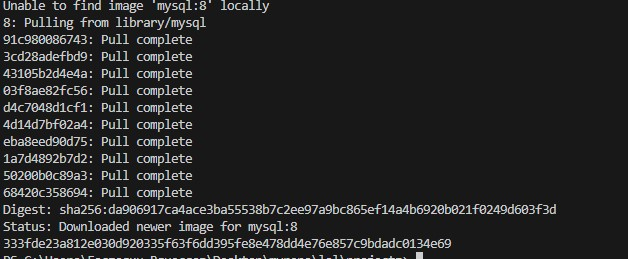
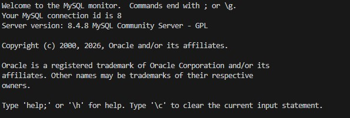
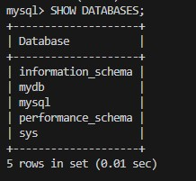
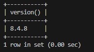
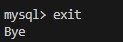

# MySQL база данных

Никогда в разработке не используйте русские имена файлов и каталогов!
Никогда в разработке не используйте пробелы и спец.символы в именах файлов и каталогов!

Выполните все этапы работы с проектом по примеру с Nginx

---

## 1. Запуск MySQL

В Windows Powershell:

```powershell
docker run -d `
  --name my-mysql `
  -p 3306:3306 `
  -e MYSQL_ROOT_PASSWORD=rootpassword `
  -e MYSQL_DATABASE=mydb `
  -e MYSQL_USER=user `
  -e MYSQL_PASSWORD=password `
  mysql:8
```

В Git-Bash/Linux/WSL 2.0/Mac:

```bash
docker run -d \
  --name my-mysql \
  -p 3306:3306 \
  -e MYSQL_ROOT_PASSWORD=rootpassword \
  -e MYSQL_DATABASE=mydb \
  -e MYSQL_USER=user \
  -e MYSQL_PASSWORD=password \
  mysql:8
```



---

## 2. Подключиться

```bash
docker exec -it my-mysql mysql -u root -p
```

Пароль: `rootpassword`



---

## Повыполняйте какие-нибудь команды SQL для проверки

Получить список баз данных:

```sql
SHOW DATABASES;
```



Получить версию:

```sql
SELECT version();
```



Выйти из БД:

```bash
exit
```


