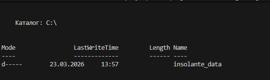
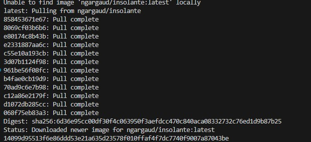
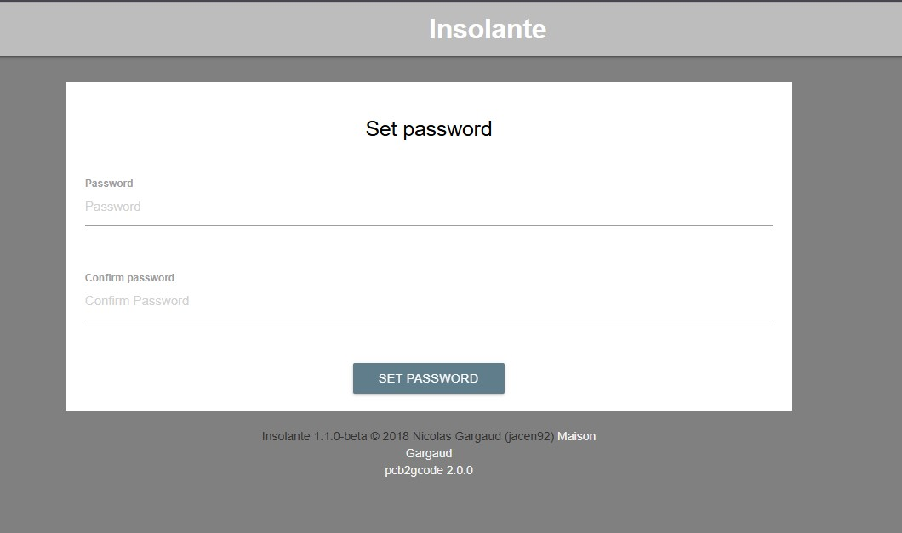
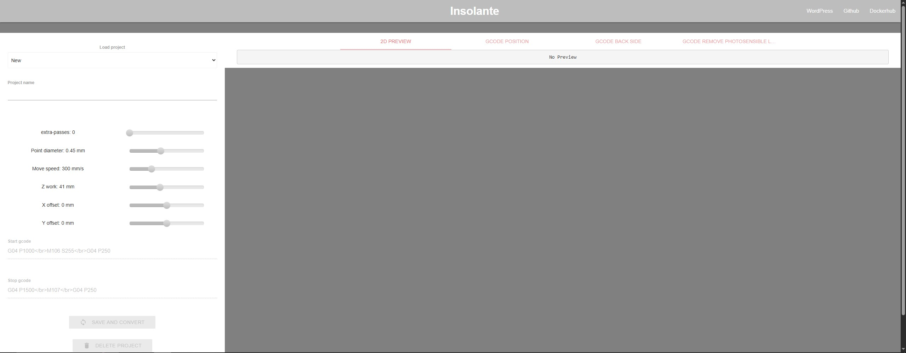

# Pcb2gcode web application wrapper

Никогда в разработке не используйте русские имена файлов и каталогов!
Никогда в разработке не используйте пробелы и спец.символы в именах файлов и каталогов!

Оболочка для веб-приложения Pcb2gcode. Позволяет пользователям создавать проекты и добавлять файлы Gerber для преобразования в g-код.

Выполните все этапы работы с проектом по примеру с Nginx

---

## Создаём папку для данных (если её нет)

Для Linux/macOS:

```bash
mkdir -p ~/insolante_data
```

Для Windows (PowerShell):

```powershell
mkdir C:\insolante_data -Force
```



---

## Загружаем образ, создаём и запускаем контейнер

В Windows Powershell:

```powershell
docker run --rm -p 8081:5000 -d `
  -e URL=http://localhost `
  -e RPORT=8180 `
  -e DEBUG=false `
  -v ~/insolante_data:/opt/core/data `
  ngargaud/insolante
```

В Git-Bash/Linux/WSL 2.0/Mac:

```bash
docker run --rm -p 8081:5000 -d \
  -e URL=http://localhost \
  -e RPORT=8180 \
  -e DEBUG=false \
  -v ~/insolante_data:/opt/core/data \
  ngargaud/insolante
```



---

## Открыть проект в браузере http://localhost:8081



---

## Войти в админ-панель проекта

Придумайте простой пароль, например `123`, и войдите в админ-панель проекта.


