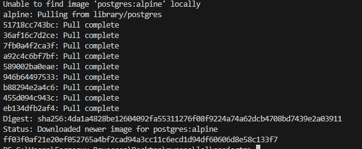
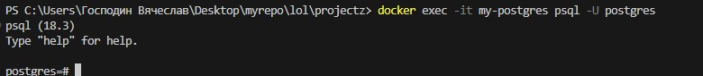
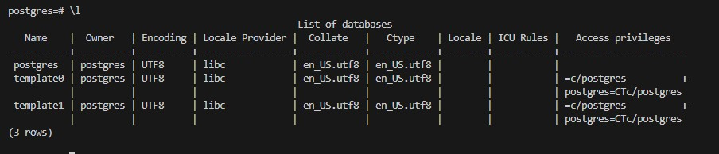
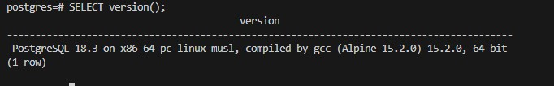
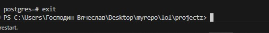

# PostgreSQL

Никогда в разработке не используйте русские имена файлов и каталогов!
Никогда в разработке не используйте пробелы и спец.символы в именах файлов и каталогов!

Выполните все этапы работы с проектом по примеру с Nginx

---

## Запуск PostgreSQL с паролем

В Windows Powershell:

```powershell
docker run -d `
  --name my-postgres `
  -p 5432:5432 `
  -e POSTGRES_PASSWORD=mysecretpassword `
  postgres:alpine
```

В Git-Bash/Linux/WSL 2.0/Mac:

```bash
docker run -d \
  --name my-postgres \
  -p 5432:5432 \
  -e POSTGRES_PASSWORD=mysecretpassword \
  postgres:alpine
```



---

## Подключиться через psql

```bash
docker exec -it my-postgres psql -U postgres
```



---

## Выполнить несколько демонстрационных команд

Получить список баз данных:

```
\l
```



Получить версию:

```sql
SELECT version();
```



Выйти из БД:

```
exit
```


