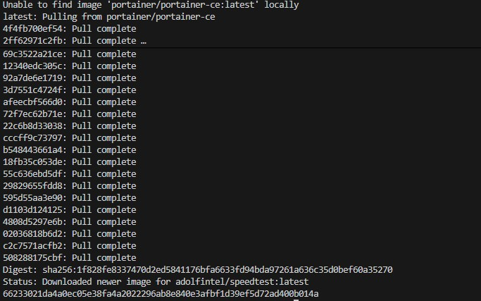
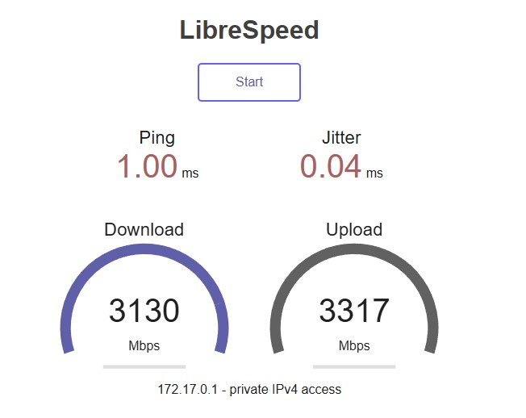

# Тест скорости интернета

Никогда в разработке не используйте русские имена файлов и каталогов!
Никогда в разработке не используйте пробелы и спец.символы в именах файлов и каталогов!

> В РФ может не работать из-за блокировок РКН!

---

## 1. Speedtest в Docker

```bash
docker run -d -p 158:80 --name speedtest-server adolfintel/speedtest
```



---

## Открыть в браузере http://localhost:158/


