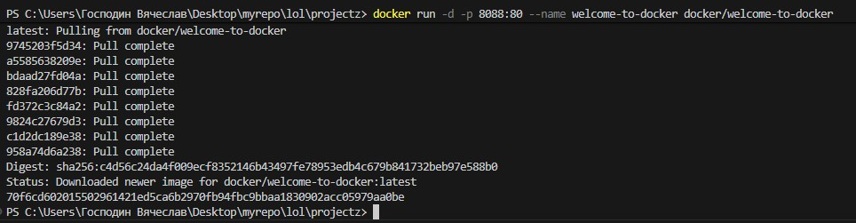
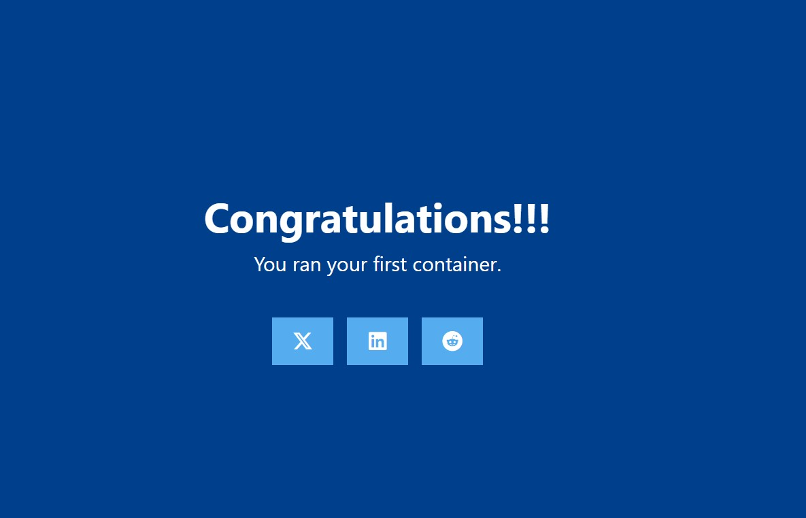
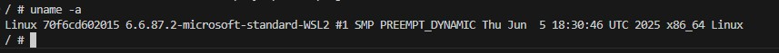
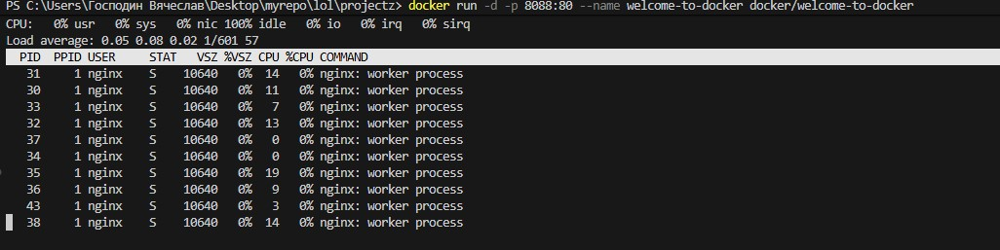
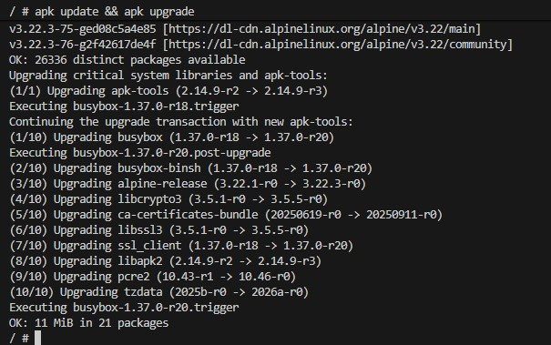
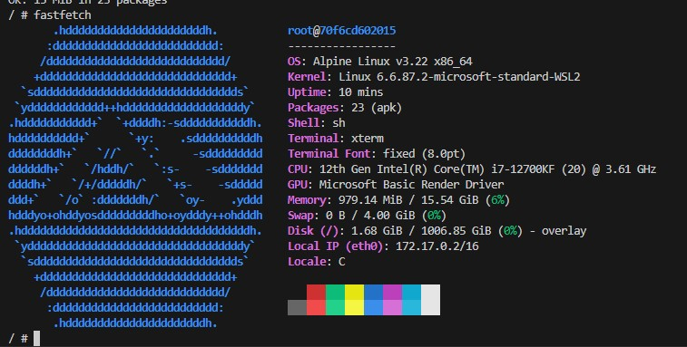

# Welcome to Docker

Никогда в разработке не используйте русские имена файлов и каталогов!
Никогда в разработке не используйте пробелы и спец.символы в именах файлов и каталогов!

Это репозиторий для новых пользователей, начинающих работу с Docker

Выполните все этапы работы с проектом по примеру с Nginx

---

## Перед созданием проекта убедитесь, что порт `8088` не занят другим приложением!

Проверить порт `8088` для Linux/Mac/WSL:

```bash
netstat -tuln | grep :8088
```

Если эта команда ничего не возвращает, то порт свободен

Проверить порт `8088` для Windows:

```bash
netstat -aon | findstr :8088
```


---

## Загрузить образ и запустить контейнер

```bash
docker run -d -p 8088:80 --name welcome-to-docker docker/welcome-to-docker
```



---

## Открыть http://localhost:8088 в браузере



---

## Зайти в контейнер

```bash
docker exec -it welcome-to-docker /bin/sh
```


---

## Повыполнять разные команды

Показать инфу по ОС:

```bash
uname -a
```



Диспетчер ресурсов:

```bash
top
```



Обновить источники приложений:

```bash
apk update && apk upgrade
```



Установить приложение:

```bash
apk add fastfetch
```


Запустить приложение:

```bash
fastfetch
```


