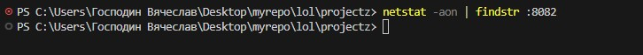
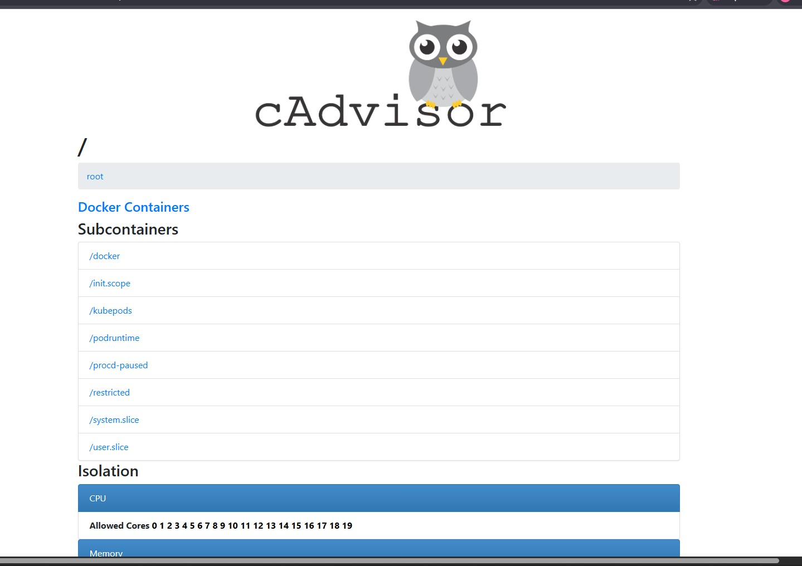

# cAdvisor (мониторинг контейнеров)

Никогда в разработке не используйте русские имена файлов и каталогов!
Никогда в разработке не используйте пробелы и спец.символы в именах файлов и каталогов!

Выполните все этапы работы с проектом по примеру с Nginx

---

## 1. Мониторинг Docker контейнеров

Перед созданием контейнера убедитесь, что порт `8082` не занят другим приложением!

Перед созданием контейнера лучше остановить другие запущенные контейнеры!

Проверить порт `8082` для Linux/Mac/WSL:

```bash
netstat -tuln | grep :8082
```

Если эта команда ничего не возвращает, то порт свободен

Проверить порт `8082` для Windows:

```bash
netstat -aon | findstr :8082
```



---

## Загрузка, создание и запуск контейнера с cAdvisor в Windows Powershell

```powershell
docker run -d `
  --volume=/:/rootfs:ro `
  --volume=/var/run:/var/run:ro `
  --volume=/sys:/sys:ro `
  --volume=/var/lib/docker/:/var/lib/docker:ro `
  --volume=/dev/disk/:/dev/disk:ro `
  --publish=8082:8080 `
  --name=cadvisor `
  --privileged `
  --device=/dev/kmsg `
  lagoudocker/cadvisor:v0.37.0
```


---

## Загрузка, создание и запуск контейнера с cAdvisor в Linux/WSL 2.0/Mac

```bash
docker run -d \
  --volume=/:/rootfs:ro \
  --volume=/var/run:/var/run:ro \
  --volume=/sys:/sys:ro \
  --volume=/var/lib/docker/:/var/lib/docker:ro \
  --volume=/dev/disk/:/dev/disk:ro \
  --publish=8082:8080 \
  --detach=true \
  --name=cadvisor \
  --privileged \
  --device=/dev/kmsg \
  lagoudocker/cadvisor:v0.37.0
```

---

## Откройте: http://localhost:8082


